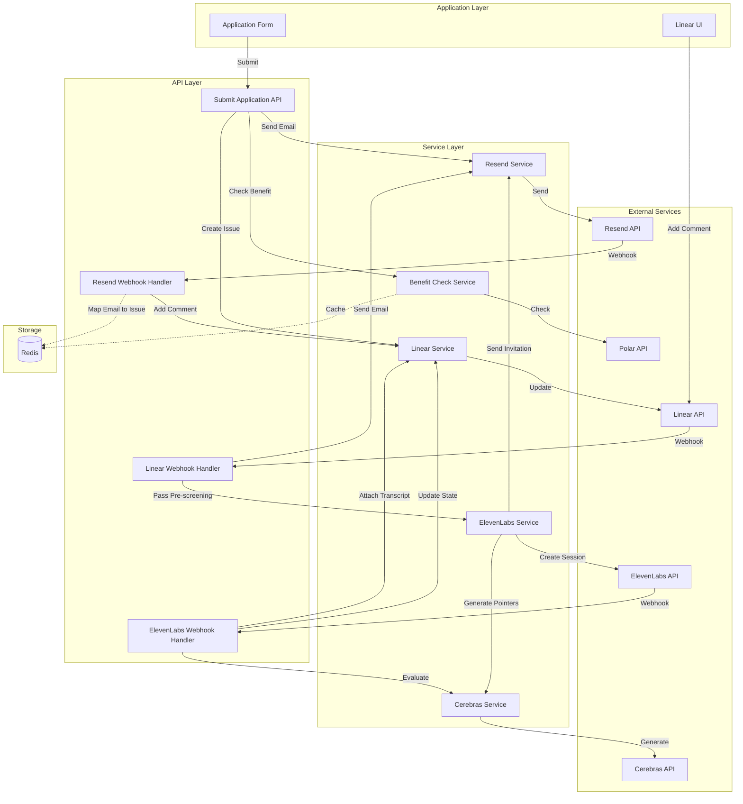

# Design Document

## Overview

This design implements two integrated communication features for candidate management: Resend email integration for bidirectional candidate communication and ElevenLabs AI screening agent integration for automated voice interviews. Both features are gated by subscription benefits and integrate seamlessly with the existing Linear-based ATS workflow.

The Resend integration enables automated confirmation emails, threaded email conversations via Linear comments, and rejection notifications. The ElevenLabs integration provides AI-powered voice screening with automatic transcript evaluation and candidate progression.

## Architecture

### High-Level Architecture



### Component Interaction Flow

**Application Submission Flow:**
1. Candidate submits application
2. System checks email communication benefit
3. If benefit exists, send confirmation email via Resend
4. Create Linear Issue for candidate
5. Add comment to Issue documenting email sent
6. Store email-to-issue mapping in Redis

**Email Reply Flow:**
1. Candidate replies to email
2. Resend webhook delivers reply
3. System validates webhook signature
4. Look up Linear Issue from email mapping
5. Add candidate's reply as system comment to Issue

**Comment-to-Email Flow:**
1. User adds comment to Linear Issue
2. Linear webhook delivers comment event
3. System checks if comment is from user (not system)
4. System checks email communication benefit
5. If benefit exists, send comment as email via Resend
6. Add note to Issue documenting email sent

**Rejection Flow:**
1. User moves Issue to rejected state
2. Linear webhook delivers state change
3. System checks email communication benefit
4. If benefit exists, send rejection email via Resend
5. Add comment to Issue documenting rejection email

**AI Screening Flow:**
1. Candidate passes pre-screening
2. System checks AI screening benefit
3. If benefit exists, generate conversation pointers via Cerebras
4. Create ElevenLabs agent session with context variables
5. Send screening invitation email with session link
6. Add comment to Issue documenting invitation

**Transcript Evaluation Flow:**
1. Candidate completes screening session
2. ElevenLabs webhook delivers transcript
3. System validates webhook signature
4. Evaluate transcript via Cerebras (pass/fail/inconclusive)
5. Attach transcript file to Linear Issue
6. Update Issue state based on evaluation
7. Add comment with evaluation summary

## Components and Interfaces

### 1. Resend Service (`lib/resend/client.ts`)

Handles all Resend API interactions using the official Resend Node.js SDK.

```typescript
import { Resend } from 'resend';

// Initialize Resend client
const resend = new Resend(process.env.RESEND_API_KEY);

// Send email using Resend SDK
async function sendEmail(params: {
  from: string;
  to: string | string[];
  subject: string;
  html?: string;
  text?: string;
  replyTo?: string;
  headers?: Record<string, string>;
  tags?: Array<{ name: string; value: string }>;
}) {
  const { data, error } = await resend.emails.send(params);
  
  if (error) {
    throw new Error(`Email send failed: ${error.message}`);
  }
  
  return data; // { id: string }
}

// Send batch emails using Resend SDK
async function sendBatchEmails(emails: Array<{
  from: string;
  to: string;
  subject: string;
  html?: string;
  text?: string;
}>) {
  const { data, error } = await resend.batch.send(emails);
  
  if (error) {
    throw new Error(`Batch send failed: ${error.message}`);
  }
  
  return data; // { data: Array<{ id: string }> }
}

// Verify webhook signature using Resend SDK
function verifyWebhookSignature(payload: string, headers: {
  id: string;
  timestamp: string;
  signature: string;
}, webhookSecret: string) {
  try {
    const event = resend.webhooks.verify({
      payload,
      headers,
      webhookSecret,
    });
    return event;
  } catch (error) {
    throw new Error('Invalid webhook signature');
  }
}
```

### 2. Email Template Service (`lib/resend/templates.ts`)

Uses Resend's built-in template feature for email content. Templates are created and managed in the Resend dashboard.

```typescript
import { Resend } from 'resend';

const resend = new Resend(process.env.RESEND_API_KEY);

// Template IDs or aliases (configured in Resend dashboard)
const TEMPLATE_IDS = {
  CONFIRMATION: process.env.RESEND_TEMPLATE_CONFIRMATION!,
  REJECTION: process.env.RESEND_TEMPLATE_REJECTION!,
  SCREENING_INVITATION: process.env.RESEND_TEMPLATE_SCREENING_INVITATION!,
  COMMENT: process.env.RESEND_TEMPLATE_COMMENT!,
};

// Send confirmation email using Resend template
async function sendConfirmationEmail(params: {
  to: string;
  candidateName: string;
  organizationName: string;
  positionTitle: string;
}) {
  const { data, error } = await resend.emails.send({
    from: process.env.RESEND_FROM_EMAIL!,
    to: params.to,
    subject: `Application Received - ${params.positionTitle}`,
    template: {
      id: TEMPLATE_IDS.CONFIRMATION,
      variables: {
        candidate_name: params.candidateName,
        organization_name: params.organizationName,
        position_title: params.positionTitle,
      },
    },
    tags: [
      { name: 'type', value: 'confirmation' },
    ],
  });
  
  if (error) {
    throw new Error(`Failed to send confirmation email: ${error.message}`);
  }
  
  return data;
}

// Send rejection email using Resend template
async function sendRejectionEmail(params: {
  to: string;
  candidateName: string;
  positionTitle: string;
}) {
  const { data, error } = await resend.emails.send({
    from: process.env.RESEND_FROM_EMAIL!,
    to: params.to,
    subject: `Update on your application for ${params.positionTitle}`,
    template: {
      id: TEMPLATE_IDS.REJECTION,
      variables: {
        candidate_name: params.candidateName,
        position_title: params.positionTitle,
      },
    },
    tags: [
      { name: 'type', value: 'rejection' },
    ],
  });
  
  if (error) {
    throw new Error(`Failed to send rejection email: ${error.message}`);
  }
  
  return data;
}

// Send screening invitation using Resend template
async function sendScreeningInvitationEmail(params: {
  to: string;
  candidateName: string;
  organizationName: string;
  positionTitle: string;
  sessionLink: string;
  jobDescription: string;
  conversationPointers: string;
}) {
  const { data, error } = await resend.emails.send({
    from: process.env.RESEND_FROM_EMAIL!,
    to: params.to,
    subject: `AI Screening Interview - ${params.positionTitle}`,
    template: {
      id: TEMPLATE_IDS.SCREENING_INVITATION,
      variables: {
        candidate_name: params.candidateName,
        organization_name: params.organizationName,
        position_title: params.positionTitle,
        session_link: params.sessionLink,
        job_description: params.jobDescription,
        conversation_pointers: params.conversationPointers,
      },
    },
    tags: [
      { name: 'type', value: 'screening_invitation' },
    ],
  });
  
  if (error) {
    throw new Error(`Failed to send screening invitation: ${error.message}`);
  }
  
  return data;
}

// Send comment as email using Resend template
async function sendCommentEmail(params: {
  to: string;
  candidateName: string;
  positionTitle: string;
  commentBody: string;
  replyToIssueId: string;
}) {
  const { data, error } = await resend.emails.send({
    from: process.env.RESEND_FROM_EMAIL!,
    to: params.to,
    subject: `Update on your application for ${params.positionTitle}`,
    template: {
      id: TEMPLATE_IDS.COMMENT,
      variables: {
        candidate_name: params.candidateName,
        position_title: params.positionTitle,
        comment_body: params.commentBody,
      },
    },
    replyTo: process.env.RESEND_FROM_EMAIL!,
    headers: {
      'X-Linear-Issue-Id': params.replyToIssueId,
    },
    tags: [
      { name: 'type', value: 'comment' },
    ],
  });
  
  if (error) {
    throw new Error(`Failed to send comment email: ${error.message}`);
  }
  
  return data;
}
```

**Resend Template Setup:**

Templates must be created in the Resend dashboard at https://resend.com/templates and published before use. Each template should define variables that will be replaced when sending emails.

**Template Variables:**

1. **Confirmation Template** (`candidate_name`, `organization_name`, `position_title`)
2. **Rejection Template** (`candidate_name`, `position_title`)
3. **Screening Invitation Template** (`candidate_name`, `organization_name`, `position_title`, `session_link`, `job_description`, `conversation_pointers`)
4. **Comment Template** (`candidate_name`, `position_title`, `comment_body`)

Variables are passed in the `template.variables` object when sending emails. If a required variable is missing, Resend will return a validation error.

### 3. Email Threading Service (`lib/resend/email-threading.ts`)

Manages email threading using email headers and dynamic reply addresses (no database required).

```typescript
// Generate a dynamic reply-to address that encodes issue metadata
function generateReplyToAddress(linearOrg: string, issueId: string): string {
  // Format: <org>+<issue_id>@yourdomain.com
  // Example: acme+issue_abc123@replies.yourdomain.com
  return `${linearOrg}+${issueId}@${process.env.RESEND_REPLY_DOMAIN}`;
}

// Parse reply-to address to extract metadata
function parseReplyToAddress(email: string): { linearOrg: string; issueId: string } | null {
  // Extract from format: <org>+<issue_id>@domain.com
  const match = email.match(/^([^+]+)\+([^@]+)@/);
  
  if (!match) {
    return null;
  }
  
  return {
    linearOrg: match[1],
    issueId: match[2],
  };
}

// Extract Message-ID from email comment for threading
function extractMessageIdFromComment(commentBody: string): string | null {
  // Parse comment to find Message-ID footer
  // Format: "---\nFrom: Candidate Name\nMessage-ID: <msg_id>"
  const match = commentBody.match(/Message-ID:\s*<?([^>\s]+)>?/i);
  return match ? match[1] : null;
}

// Strip email formatting and reply quotes
function cleanEmailContent(emailBody: string): string {
  // Remove quoted text (lines starting with >)
  let cleaned = emailBody.replace(/^>.*$/gm, '');
  
  // Remove "On [date], [person] wrote:" patterns
  cleaned = cleaned.replace(/On .+? wrote:/gi, '');
  
  // Remove excessive whitespace
  cleaned = cleaned.replace(/\n{3,}/g, '\n\n').trim();
  
  // Strip HTML if present (basic cleanup)
  cleaned = cleaned.replace(/<[^>]*>/g, '');
  
  return cleaned;
}

// Format email comment with metadata footer
function formatEmailCommentWithMetadata(
  emailBody: string,
  senderName: string,
  messageId: string
): string {
  return `${emailBody}\n\n---\n\nFrom: ${senderName}\nMessage-ID: ${messageId}`;
}

// Send email with proper threading headers
async function sendThreadedEmail(params: {
  to: string;
  replyTo: string;
  subject: string;
  template: { id: string; variables: Record<string, string> };
  inReplyTo?: string; // Message-ID of the email being replied to
  references?: string[]; // Array of Message-IDs in the conversation chain
  tags?: Array<{ name: string; value: string }>;
}) {
  const headers: Record<string, string> = {};
  
  // Add threading headers if this is a reply
  if (params.inReplyTo) {
    headers['In-Reply-To'] = `<${params.inReplyTo}>`;
  }
  
  if (params.references && params.references.length > 0) {
    headers['References'] = params.references.map(id => `<${id}>`).join(' ');
  }
  
  const { data, error } = await resend.emails.send({
    from: process.env.RESEND_FROM_EMAIL!,
    to: params.to,
    replyTo: params.replyTo,
    subject: params.subject,
    template: params.template,
    headers,
    tags: params.tags,
  });
  
  if (error) {
    throw new Error(`Failed to send email: ${error.message}`);
  }
  
  return data;
}
```

**Email Threading Implementation:**

Instead of storing email mappings in Redis, we use:
1. **Dynamic Reply-To Addresses:** Encode Linear org and issue ID in the reply-to email address
2. **Email Headers:** Use `Message-ID`, `In-Reply-To`, and `References` headers for proper threading
3. **Comment Metadata:** Store Message-ID in Linear comments for future replies
4. **Content Cleaning:** Strip reply quotes and formatting before adding to Linear

### 4. Resend Webhook Handler (`app/api/webhooks/resend/route.ts`)

Processes incoming Resend webhook events using the Resend SDK for signature verification.

```typescript
import { Resend } from 'resend';

const resend = new Resend(process.env.RESEND_API_KEY);

// Resend webhook event types
interface ResendWebhookEvent {
  type: 'email.sent' | 'email.delivered' | 'email.bounced' | 'email.complained' | 'email.opened' | 'email.clicked';
  created_at: string;
  data: {
    email_id: string;
    from: string;
    to: string[];
    subject: string;
    created_at: string;
    // Additional fields based on event type
  };
}

async function POST(request: NextRequest): Promise<NextResponse> {
  try {
    // Get raw body for signature verification
    const body = await request.text();
    
    // Get Svix headers (Resend uses Svix for webhooks)
    const svixId = request.headers.get('svix-id');
    const svixTimestamp = request.headers.get('svix-timestamp');
    const svixSignature = request.headers.get('svix-signature');
    
    if (!svixId || !svixTimestamp || !svixSignature) {
      return NextResponse.json(
        { error: 'Missing webhook headers' },
        { status: 401 }
      );
    }
    
    // Verify webhook using Resend SDK
    try {
      const event = resend.webhooks.verify({
        payload: body,
        headers: {
          id: svixId,
          timestamp: svixTimestamp,
          signature: svixSignature,
        },
        webhookSecret: process.env.RESEND_WEBHOOK_SECRET!,
      });
      
      // Route to appropriate handler based on event type
      await handleResendWebhook(event as ResendWebhookEvent);
      
      return NextResponse.json({ success: true });
    } catch (error) {
      logger.error('Webhook signature verification failed', error as Error);
      return NextResponse.json(
        { error: 'Invalid signature' },
        { status: 401 }
      );
    }
  } catch (error) {
    logger.error('Resend webhook error', error as Error);
    return NextResponse.json(
      { error: 'Internal error' },
      { status: 500 }
    );
  }
}
```

**Note:** Resend uses Svix for webhook delivery, which provides automatic signature verification, retry logic, and webhook management. The webhook events are delivered with `svix-*` headers for verification.

### 5. ElevenLabs Service (`lib/elevenlabs/client.ts`)

Handles ElevenLabs API interactions using the official ElevenLabs JS SDK with dynamic variables.

```typescript
import { ElevenLabsClient } from '@elevenlabs/elevenlabs-js';

// Initialize ElevenLabs client
const elevenlabs = new ElevenLabsClient({
  apiKey: process.env.ELEVENLABS_API_KEY,
});

// Get agent details (to verify agent exists and get configuration)
async function getAgent(agentId: string) {
  const agent = await elevenlabs.conversationalAi.agents.get(agentId);
  return agent;
}

// Create a public talk-to page URL with dynamic variables
// ElevenLabs supports two methods for passing variables:
// 1. Base64-encoded JSON via 'vars' parameter
// 2. Individual 'var_' prefixed query parameters
async function createAgentSessionLink(
  agentId: string,
  variables: {
    company_name: string;
    job_application: string;
    job_description: string;
    conversation_pointers: string;
    candidate_name: string;
  }
): Promise<string> {
  // Method 1: Base64-encoded JSON (recommended for multiple variables)
  const encodedVars = Buffer.from(JSON.stringify(variables)).toString('base64');
  const url = `https://elevenlabs.io/app/talk-to?agent_id=${agentId}&vars=${encodedVars}`;
  
  return url;
  
  // Alternative Method 2: Individual query parameters
  // const params = new URLSearchParams({ agent_id: agentId });
  // Object.entries(variables).forEach(([key, value]) => {
  //   params.append(`var_${key}`, encodeURIComponent(value));
  // });
  // return `https://elevenlabs.io/app/talk-to?${params.toString()}`;
}

// Verify webhook signature using ElevenLabs SDK
async function verifyElevenLabsWebhook(
  payload: string,
  signature: string,
  secret: string
) {
  try {
    const event = await elevenlabs.webhooks.constructEvent(
      payload,
      signature,
      secret
    );
    return event;
  } catch (error) {
    throw new Error('Invalid webhook signature');
  }
}
```

**Dynamic Variables Implementation:**

ElevenLabs agents support dynamic variables that can be injected at runtime through URL parameters. Variables are defined in the agent's configuration using double curly braces `{{variable_name}}` in:
- System prompts
- First messages
- Tool parameters

The variables are passed via the public talk-to page URL and are automatically replaced when the conversation starts.

### 6. Conversation Pointers Generator (`lib/cerebras/conversation-pointers.ts`)

Generates conversation pointers for ElevenLabs agent using Cerebras.

```typescript
interface ConversationPointers {
  pointers: string[];
}

async function generateConversationPointers(
  jobDescription: string,
  candidateApplication: string,
  linearOrgId: string
): Promise<ConversationPointers>;
```

### 7. Transcript Evaluator (`lib/cerebras/transcript-evaluation.ts`)

Evaluates screening transcripts using Cerebras.

```typescript
interface TranscriptEvaluation {
  result: 'pass' | 'fail' | 'inconclusive';
  reasoning: string;
  confidence: 'high' | 'medium' | 'low';
  keyPoints: string[];
}

async function evaluateTranscript(
  transcript: string,
  jobDescription: string,
  candidateApplication: string,
  linearOrgId: string
): Promise<TranscriptEvaluation>;
```

### 8. ElevenLabs Webhook Handler (`app/api/webhooks/elevenlabs/route.ts`)

Processes incoming ElevenLabs webhook events for completed screening sessions.

```typescript
// ElevenLabs webhook events follow their standard format
interface ElevenLabsWebhookEvent {
  type: 'conversation.completed' | 'conversation.started' | 'conversation.error';
  data: {
    conversation_id: string;
    agent_id: string;
    transcript?: Array<{
      role: 'agent' | 'user';
      message: string;
      timestamp: string;
    }>;
    duration_seconds?: number;
    ended_at?: string;
    metadata?: Record<string, any>;
  };
}

async function POST(request: NextRequest): Promise<NextResponse> {
  try {
    // Get raw body and signature
    const body = await request.text();
    const signature = request.headers.get('x-elevenlabs-signature');
    
    if (!signature) {
      return NextResponse.json({ error: 'Missing signature' }, { status: 401 });
    }
    
    // Verify webhook signature
    const isValid = verifyElevenLabsWebhook(
      body,
      signature,
      process.env.ELEVENLABS_WEBHOOK_SECRET!
    );
    
    if (!isValid) {
      return NextResponse.json({ error: 'Invalid signature' }, { status: 401 });
    }
    
    // Parse event
    const event: ElevenLabsWebhookEvent = JSON.parse(body);
    
    // Route to appropriate handler
    if (event.type === 'conversation.completed') {
      await handleConversationCompleted(event);
    }
    
    return NextResponse.json({ success: true });
  } catch (error) {
    logger.error('ElevenLabs webhook error', error as Error);
    return NextResponse.json({ error: 'Internal error' }, { status: 500 });
  }
}
```

### 9. Benefit Check Extensions

Extend existing benefit check service to support new benefits.

```typescript
// Add to lib/config.ts
export const config = {
  // ... existing config
  polar: {
    // ... existing polar config
    benefits: {
      // ... existing benefits
      emailCommunication: process.env.POLAR_EMAIL_COMMUNICATION_BENEFIT_ID!,
      aiScreening: process.env.POLAR_AI_SCREENING_BENEFIT_ID!,
    }
  }
};
```

### 10. Linear Comment Detection (`lib/linear/comment-detection.ts`)

Determines if a comment is from a user or the system.

```typescript
interface CommentMetadata {
  isSystemMessage: boolean;
  authorName?: string;
  authorEmail?: string;
}

async function getCommentMetadata(
  commentId: string,
  linearAccessToken: string
): Promise<CommentMetadata>;

function isSystemComment(comment: CommentMetadata): boolean;
```

## Data Models

### Agent Session Mapping (Redis)

```typescript
// Key: screening:session:{sessionId}
interface ScreeningSessionData {
  issueId: string;
  candidateEmail: string;
  candidateName: string;
  linearOrg: string;
  projectId: string;
  jobDescription: string;
  createdAt: string; // ISO 8601
  expiresAt: string; // ISO 8601
}
```

### Email Threading Data (No Database Required)

Email threading is handled entirely through email headers and dynamic addresses:

**Outbound Emails:**
- `Reply-To`: `<linearOrg>+<issueId>@replies.yourdomain.com`
- `Message-ID`: Automatically generated by Resend (e.g., `<msg_abc123@resend.com>`)
- `In-Reply-To`: Message-ID of the email being replied to (if applicable)
- `References`: Space-separated list of Message-IDs in the conversation chain

**Linear Comments (Email Replies):**
```markdown
Hey, thanks for your response. My availability is Monday-Friday 9am-5pm.

---

From: John Doe
Message-ID: msg_abc123
```

**Inbound Email Processing:**
1. Parse `To` address to extract `linearOrg` and `issueId`
2. Look up the last comment on the Issue to find the previous `Message-ID`
3. Clean email content (remove quotes and formatting)
4. Add cleaned content as a system comment with metadata footer
5. Store new `Message-ID` in comment for future threading

## Correctness Properties

*A property is a characteristic or behavior that should hold true across all valid executions of a system—essentially, a formal statement about what the system should do. Properties serve as the bridge between human-readable specifications and machine-verifiable correctness guarantees.*

### Property Reflection

After analyzing all acceptance criteria, several properties can be consolidated:

**Redundancy Elimination:**
- Properties 1.2, 2.3, 4.2, 5.2, 8.2 all test "email sent → comment added". These can be combined into one comprehensive property about email-comment synchronization.
- Properties 1.3, 2.4, 4.3, 5.3 all test benefit checks for specific features. These are covered by the general benefit enforcement properties 9.1 and 9.2.
- Properties 1.5, 4.4, 5.4 all test required fields in emails. These can be combined into one property about email content completeness.
- Properties 6.1, 6.2, 6.3, 6.4, 6.5 all test agent session variables. These can be combined into one property about session context completeness.
- Properties 3.4, 5.5, 8.5 all test error logging for orphaned/failed operations. These can be combined into one property about error handling.
- Properties 10.1 and 10.2 both test webhook signature validation. These can be combined into one property.

### Correctness Properties

**Property 1: Application confirmation email delivery**
*For any* candidate application submission, when the organization has the email communication benefit, a confirmation email should be sent to the candidate's email address
**Validates: Requirements 1.1, 1.3**

**Property 2: Email-comment synchronization**
*For any* email sent by the System (confirmation, rejection, screening invitation, or comment), a corresponding comment should be added to the Linear Issue documenting the email
**Validates: Requirements 1.2, 2.3, 4.2, 5.2**

**Property 3: Email content completeness**
*For any* email sent by the System, the email content should include all required contextual information (candidate name, organization name, position title as applicable)
**Validates: Requirements 1.5, 4.4, 5.4**

**Property 4: Application processing resilience**
*For any* application submission, if email sending fails, the application should still be processed successfully and the error should be logged
**Validates: Requirements 1.4**

**Property 5: User comment to email conversion**
*For any* user comment added to a candidate's Linear Issue, when the organization has the email communication benefit, the comment content should be sent as an email to the candidate
**Validates: Requirements 2.1**

**Property 6: System message filtering**
*For any* comment added to a Linear Issue, if the comment is a System Message, no email should be sent to the candidate
**Validates: Requirements 2.2**

**Property 7: Multiple comment handling**
*For any* sequence of comments added to a Linear Issue, each user comment should result in a separate email being sent
**Validates: Requirements 2.5**

**Property 8: Email reply webhook processing**
*For any* candidate email reply received via Resend webhook, the System should process the webhook and add the email content as a System Message to the corresponding Linear Issue
**Validates: Requirements 3.1, 3.2**

**Property 9: Email content preservation**
*For any* email reply received, the content added to the Linear Issue should preserve the original email formatting and content without loss
**Validates: Requirements 3.3**

**Property 10: Rejection email delivery**
*For any* candidate Linear Issue moved to rejected state, when the organization has the email communication benefit, a rejection email should be sent to the candidate
**Validates: Requirements 4.1**

**Property 11: Rejection email idempotence**
*For any* candidate Linear Issue, moving it to rejected state multiple times should result in only one rejection email being sent
**Validates: Requirements 4.5**

**Property 12: Screening invitation delivery**
*For any* candidate who passes pre-screening, when the organization has the AI screening benefit, a screening invitation email with an ElevenLabs Agent session link should be sent
**Validates: Requirements 5.1**

**Property 13: Agent session context completeness**
*For any* ElevenLabs Agent session created, the session should include all required context variables: organization name, complete Linear Issue content, job description from Project, Cerebras-generated conversation pointers, and candidate's first name
**Validates: Requirements 6.1, 6.2, 6.3, 6.4, 6.5**

**Property 14: Transcript webhook processing**
*For any* completed ElevenLabs screening session, the System should receive the transcript via webhook and evaluate it using Cerebras to determine pass, fail, or inconclusive status
**Validates: Requirements 7.1, 7.2**

**Property 15: Pass evaluation state transition**
*For any* screening transcript evaluation with pass result, the candidate's Linear Issue should be advanced to the next stage
**Validates: Requirements 7.3**

**Property 16: Fail evaluation state transition**
*For any* screening transcript evaluation with fail result, the candidate's Linear Issue should be moved to rejected state
**Validates: Requirements 7.4**

**Property 17: Inconclusive evaluation state preservation**
*For any* screening transcript evaluation with inconclusive result, the candidate's Linear Issue should remain in its current state
**Validates: Requirements 7.5**

**Property 18: Transcript attachment**
*For any* screening transcript received, the transcript should be attached as a file to the candidate's Linear Issue with complete conversation data including timestamps
**Validates: Requirements 8.1, 8.4**

**Property 19: Transcript attachment fallback**
*For any* screening transcript where file attachment fails, the transcript content should be added as a comment to the Linear Issue instead
**Validates: Requirements 8.3**

**Property 20: Email communication benefit enforcement**
*For any* email communication feature access (confirmation, comment-to-email, rejection), the System should verify the organization has the email communication benefit before allowing the operation
**Validates: Requirements 9.1**

**Property 21: AI screening benefit enforcement**
*For any* AI screening feature access (invitation, session creation), the System should verify the organization has the AI screening benefit before allowing the operation
**Validates: Requirements 9.2**

**Property 22: Benefit check failure handling**
*For any* operation requiring a benefit that the organization does not have, the System should prevent the action, log the attempt, and return a clear error message indicating the missing benefit
**Validates: Requirements 9.3, 9.4**

**Property 23: Benefit status immediacy**
*For any* benefit status change (grant or revoke), the next operation requiring that benefit should reflect the new status immediately
**Validates: Requirements 9.5**

**Property 24: Webhook signature validation**
*For any* webhook request (Resend or ElevenLabs), the System should validate the webhook signature before processing the payload
**Validates: Requirements 10.1, 10.2**

**Property 25: Invalid webhook rejection**
*For any* webhook request with invalid signature or malformed payload, the System should reject the request, return an appropriate error response, and log the security event
**Validates: Requirements 10.3, 10.4**

**Property 26: Webhook retry support**
*For any* webhook processing failure due to transient errors, the System should return a retry-able error status to allow the webhook provider to redeliver
**Validates: Requirements 10.5**

**Property 27: Orphaned data error handling**
*For any* email reply or transcript that cannot be matched to a Linear Issue, the System should log the error and notify administrators
**Validates: Requirements 3.4, 8.5**

**Property 28: External service failure logging**
*For any* external service failure (ElevenLabs session creation, email sending), the System should log the error and notify administrators
**Validates: Requirements 5.5**


## Error Handling

### Email Sending Failures

**Strategy:** Graceful degradation with logging
- Application processing continues even if email fails
- Errors are logged with full context (candidate, organization, email type)
- Administrators are notified of persistent failures
- No retry logic for emails (Resend handles retries internally)

### Webhook Processing Failures

**Strategy:** Return retry-able status codes
- Transient errors (network, timeout): Return 500 for retry
- Permanent errors (invalid signature, malformed payload): Return 400/401, no retry
- All failures are logged with correlation IDs
- Security events are emitted for authentication failures

### Benefit Check Failures

**Strategy:** Fail-safe with clear messaging
- Operations are blocked when benefit is missing
- Clear error messages indicate which benefit is required
- Benefit check failures are logged for analytics
- Degraded mode: If Polar is unavailable, deny access (fail closed)

### External Service Failures

**Strategy:** Retry with exponential backoff
- Linear API: 3 retries with exponential backoff
- Cerebras API: 3 retries with exponential backoff
- ElevenLabs API: 3 retries with exponential backoff
- Resend API: No retries (handled by Resend)
- All failures logged with full context

### Data Mapping Failures

**Strategy:** Log and notify
- Orphaned emails (no matching Issue): Log error, notify admins, store in dead letter queue
- Orphaned transcripts (no matching session): Log error, notify admins, store in dead letter queue
- Invalid mappings: Log error, attempt recovery by searching Linear

### Transcript Attachment Failures

**Strategy:** Fallback to comment
- If file attachment fails, add transcript as comment text
- Log the attachment failure for investigation
- Ensure transcript is never lost

## Testing Strategy

### Unit Testing

**Framework:** Vitest

**Coverage Areas:**
1. Email template generation
   - Test each template type with various inputs
   - Verify required fields are present
   - Test HTML and text versions

2. Email mapping storage and retrieval
   - Test storing mappings in Redis
   - Test retrieving mappings by email ID
   - Test retrieving Issue by candidate email

3. Benefit checking logic
   - Test benefit verification with various states
   - Test caching behavior
   - Test error handling

4. Comment detection
   - Test system vs user comment identification
   - Test various comment author types

5. Conversation pointer generation
   - Test pointer generation with various job descriptions
   - Test handling of empty or invalid inputs

6. Transcript evaluation
   - Test evaluation with various transcript types
   - Test pass/fail/inconclusive determination
   - Test confidence scoring

7. Webhook signature validation
   - Test valid signatures
   - Test invalid signatures
   - Test missing signatures

### Property-Based Testing

**Framework:** fast-check (JavaScript/TypeScript property-based testing library)

**Configuration:** Minimum 100 iterations per property test

**Test Organization:**
- Each correctness property will be implemented as a separate property-based test
- Tests will be tagged with comments referencing the design document property
- Tag format: `// Feature: candidate-communication-integrations, Property {number}: {property_text}`

**Property Test Coverage:**

1. **Email Delivery Properties (Properties 1, 5, 10, 12)**
   - Generate random application data, comments, state changes
   - Verify emails are sent when benefits exist
   - Verify emails are blocked when benefits are missing

2. **Email-Comment Synchronization (Property 2)**
   - Generate random email sending events
   - Verify corresponding comments are added to Issues

3. **Email Content Properties (Property 3)**
   - Generate random candidate and job data
   - Verify all required fields are present in emails

4. **Resilience Properties (Property 4)**
   - Simulate email sending failures
   - Verify application processing continues

5. **Comment Filtering (Property 6)**
   - Generate random comments (system and user)
   - Verify only user comments trigger emails

6. **Multiple Comment Handling (Property 7)**
   - Generate sequences of comments
   - Verify each results in separate email

7. **Email Reply Processing (Properties 8, 9)**
   - Generate random email replies
   - Verify they are added to correct Issues
   - Verify content is preserved

8. **Rejection Idempotence (Property 11)**
   - Move Issues to rejected state multiple times
   - Verify only one rejection email is sent

9. **Agent Session Context (Property 13)**
   - Generate random candidate and job data
   - Verify all context variables are included

10. **Transcript Evaluation (Properties 14, 15, 16, 17)**
    - Generate random transcripts
    - Verify evaluation produces valid results
    - Verify state transitions match evaluation results

11. **Transcript Attachment (Properties 18, 19)**
    - Generate random transcripts
    - Verify attachment or fallback to comment
    - Verify content preservation

12. **Benefit Enforcement (Properties 20, 21, 22, 23)**
    - Generate random operations with various benefit states
    - Verify operations are allowed/blocked correctly
    - Verify benefit changes take effect immediately

13. **Webhook Security (Properties 24, 25, 26)**
    - Generate random webhook requests with valid/invalid signatures
    - Verify signature validation
    - Verify error responses

14. **Error Handling (Properties 27, 28)**
    - Generate orphaned data scenarios
    - Verify error logging and notifications

### Integration Testing

**Scope:** End-to-end flows with mocked external services

**Test Scenarios:**
1. Complete application-to-confirmation flow
2. Comment-to-email-to-reply round trip
3. Pre-screening-to-AI-screening-to-evaluation flow
4. Rejection flow with email notification
5. Benefit check integration with all features
6. Webhook processing with signature validation

**Mocking Strategy:**
- Mock Resend API for email sending
- Mock ElevenLabs API for session creation
- Mock Cerebras API for AI generation
- Use real Redis for state management
- Use real Linear SDK with test organization

### Manual Testing Checklist

1. Send test application and verify confirmation email
2. Reply to confirmation email and verify comment in Linear
3. Add comment in Linear and verify email to candidate
4. Move Issue to rejected and verify rejection email
5. Trigger AI screening and verify invitation email
6. Complete screening session and verify transcript attachment
7. Test benefit gating by removing benefits
8. Test webhook signature validation with invalid signatures

## Implementation Notes

### Environment Variables

```bash
# Resend Configuration
RESEND_API_KEY=re_xxx
RESEND_FROM_EMAIL=noreply@yourdomain.com
RESEND_REPLY_DOMAIN=replies.yourdomain.com
RESEND_WEBHOOK_SECRET=whsec_xxx

# Resend Template IDs (created in Resend dashboard)
RESEND_TEMPLATE_CONFIRMATION=template_xxx
RESEND_TEMPLATE_REJECTION=template_xxx
RESEND_TEMPLATE_SCREENING_INVITATION=template_xxx
RESEND_TEMPLATE_COMMENT=template_xxx

# ElevenLabs Configuration
ELEVENLABS_API_KEY=el_xxx
ELEVENLABS_AGENT_ID=agent_xxx
ELEVENLABS_WEBHOOK_SECRET=whsec_xxx

# Polar Benefit IDs
POLAR_EMAIL_COMMUNICATION_BENEFIT_ID=benefit_xxx
POLAR_AI_SCREENING_BENEFIT_ID=benefit_xxx
```

### Redis Key Patterns

```
screening:session:{sessionId} -> ScreeningSessionData
```

**Note:** Email threading does not require Redis storage. All metadata is encoded in email addresses and headers.

### Webhook Endpoints

```
POST /api/webhooks/resend
POST /api/webhooks/elevenlabs
```

### Linear Webhook Updates

Extend existing Linear webhook handler to:
- Detect comment creation events
- Filter system vs user comments
- Trigger email sending for user comments
- Detect state changes to rejected
- Trigger rejection emails

### Resend Email Headers

Use standard email threading headers and dynamic reply-to addresses:
```
Reply-To: {linearOrg}+{issueId}@replies.yourdomain.com
Message-ID: <auto-generated-by-resend>
In-Reply-To: <previous-message-id> (for replies)
References: <msg1> <msg2> <msg3> (conversation chain)
```

Custom headers for tracking:
```
X-Email-Type: confirmation|comment|rejection|screening-invitation
```

### ElevenLabs Agent Configuration

Agent must be pre-configured in ElevenLabs dashboard with dynamic variables:

**System Prompt with Dynamic Variables:**
```
You are an AI interviewer for {{company_name}} conducting a preliminary screening call for the {{candidate_name}} position.

Job Description:
{{job_description}}

Candidate Application:
{{job_application}}

Conversation Focus Areas:
{{conversation_pointers}}

Your role is to:
1. Welcome {{candidate_name}} warmly and professionally
2. Ask relevant questions based on the job requirements and their application
3. Assess their qualifications, experience, and cultural fit
4. Provide a positive candidate experience regardless of the outcome
5. Keep the conversation focused and efficient (10-15 minutes)

Be conversational, empathetic, and professional throughout the interview.
```

**First Message with Dynamic Variables:**
```
Hi {{candidate_name}}! Thank you for applying to {{company_name}}. I'm an AI interviewer here to conduct a preliminary screening for the position you applied for. This should take about 10-15 minutes. Are you ready to begin?
```

**Additional Configuration:**
- **Voice Settings:** Select an appropriate voice and model (e.g., `eleven_turbo_v2_5` for low latency)
- **Language:** Set to appropriate language (e.g., "en" for English)
- **Webhook Configuration:** Configure webhook URL to point to `/api/webhooks/elevenlabs` with event type `conversation.completed`

**Dynamic Variables:**
The following variables will be passed via URL parameters when generating the session link:
- `company_name` - Organization name
- `candidate_name` - Candidate's first name
- `job_description` - Full job description from Linear Project
- `job_application` - Complete Linear Issue content (candidate's application)
- `conversation_pointers` - AI-generated conversation focus areas from Cerebras

These variables are automatically replaced when the candidate accesses the talk-to page URL.

### Cerebras Prompts

**Conversation Pointers Prompt:**
```
Given a job description and candidate application, generate 3-5 conversation pointers 
that an AI interviewer should explore during a screening call. Focus on:
- Key qualifications mentioned in the job description
- Experience and skills highlighted in the application
- Potential gaps or areas needing clarification
- Cultural fit indicators

Job Description:
{jobDescription}

Candidate Application:
{candidateApplication}

Generate conversation pointers as a JSON array of strings.
```

**Transcript Evaluation Prompt:**
```
Evaluate the following screening call transcript and determine if the candidate 
should pass, fail, or if the result is inconclusive.

Consider:
- Alignment with job requirements
- Communication skills
- Technical competency (if applicable)
- Cultural fit indicators
- Red flags or concerns

Job Description:
{jobDescription}

Candidate Application:
{candidateApplication}

Transcript:
{transcript}

Provide your evaluation as JSON:
{
  "result": "pass" | "fail" | "inconclusive",
  "reasoning": "explanation",
  "confidence": "high" | "medium" | "low",
  "keyPoints": ["point1", "point2", ...]
}
```

## Security Considerations

1. **Webhook Signature Validation:** All webhooks must validate signatures before processing
2. **Email Address Validation:** Validate email addresses before sending to prevent abuse
3. **Rate Limiting:** Implement rate limits on webhook endpoints to prevent DoS
4. **PII Protection:** Email content and transcripts contain PII - ensure proper access controls
5. **Benefit Verification:** Always verify benefits before granting access to premium features
6. **Redis Security:** Use Redis authentication and encryption in transit
7. **API Key Rotation:** Support rotation of Resend, ElevenLabs, and Cerebras API keys
8. **Audit Logging:** Log all email sends, benefit checks, and webhook events for audit trail

## Performance Considerations

1. **Async Processing:** Email sending and webhook processing should be async to avoid blocking
2. **Redis Caching:** Cache benefit checks for 5 minutes to reduce Polar API calls
3. **Batch Operations:** Consider batching multiple emails if sending to multiple candidates
4. **Webhook Timeouts:** Set appropriate timeouts for webhook processing (30 seconds max)
5. **Cerebras Rate Limits:** Respect Cerebras API rate limits with exponential backoff
6. **Email Queue:** Consider implementing email queue for high-volume scenarios
7. **Transcript Storage:** Large transcripts should be stored as files, not in Redis

## Monitoring and Observability

### Metrics to Track

1. **Email Metrics:**
   - Emails sent per type (confirmation, comment, rejection, screening)
   - Email send failures
   - Email delivery rates (from Resend webhooks)

2. **Webhook Metrics:**
   - Webhook requests received
   - Webhook processing time
   - Webhook failures by type

3. **Benefit Check Metrics:**
   - Benefit checks performed
   - Benefit check failures
   - Operations blocked by missing benefits

4. **AI Screening Metrics:**
   - Screening invitations sent
   - Screening sessions completed
   - Evaluation results (pass/fail/inconclusive)
   - Average transcript evaluation time

5. **Error Metrics:**
   - Orphaned emails/transcripts
   - External service failures
   - Webhook signature validation failures

### Logging

All operations should log:
- Correlation ID for tracing
- Organization ID
- Candidate email (hashed for privacy)
- Operation type
- Success/failure status
- Error details if applicable

### Alerts

Configure alerts for:
- High email send failure rate (>5% in 5 minutes)
- Webhook signature validation failures (>10 in 5 minutes)
- Orphaned emails/transcripts (>5 in 1 hour)
- External service failures (>10 in 5 minutes)
- Benefit check failures (>50 in 5 minutes)

## Migration and Rollout

### Phase 1: Resend Email Integration
1. Deploy email service and templates
2. Deploy Resend webhook handler
3. Update application submission to send confirmation emails
4. Enable for pilot organizations with email benefit

### Phase 2: Comment-to-Email
1. Update Linear webhook handler for comment events
2. Deploy comment-to-email logic
3. Enable for pilot organizations
4. Monitor email delivery and replies

### Phase 3: Rejection Emails
1. Update Linear webhook handler for state changes
2. Deploy rejection email logic
3. Enable for all organizations with email benefit

### Phase 4: ElevenLabs Integration
1. Deploy ElevenLabs service
2. Deploy conversation pointer generation
3. Deploy ElevenLabs webhook handler
4. Deploy transcript evaluation
5. Enable for pilot organizations with AI screening benefit

### Rollback Plan

Each phase can be rolled back independently:
- Feature flags to disable email sending
- Feature flags to disable AI screening
- Webhook handlers can be disabled without affecting core functionality
- No database migrations required (Redis only)
